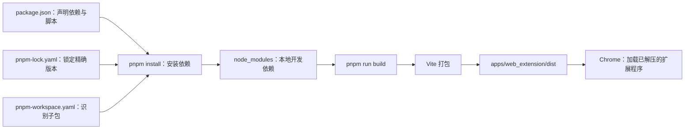

# clearvibe-extension - 产品说明与开发契约
## 基础配置
### 构建包
本项目是一个 pnpm Monorepo。把它理解为：Node.js 负责运行工具，pnpm 负责管理依赖，Vite 负责把源码打成 Chrome 能加载的扩展目录。



#### 先认识当前项目的文件

| 文件 | 它解决的问题 | 当前项目中的作用 |
| --- | --- | --- |
| 根 `package.json` | 需要哪些依赖、有哪些命令 | 声明 React、Vite、TypeScript，并定义 `dev`、`build` 命令。 |
| `pnpm-workspace.yaml` | 哪些目录属于同一 Monorepo | 将 `apps/*` 与 `packages/*` 下的目录识别为子包。它需要手动维护，不由 pnpm 自动创建。 |
| `pnpm-lock.yaml` | 每个依赖到底使用哪个版本 | 由 pnpm 在首次解析依赖时自动生成/更新，保证每台电脑安装相同版本。 |
| `apps/web_extension/package.json` | 扩展前端子包的命令 | `build` 实际运行 `vite build`。 |
| `apps/web_extension/vite.config.ts` | Vite 如何打包 | 配置新标签页与 Popup 的入口，输出目录为 `dist`。 |
| `apps/web_extension/public/manifest.json` | Chrome 如何识别扩展 | 定义扩展名、权限、Popup 和新标签页入口。 |

#### 一次性准备系统环境

本项目锁定的 Vite 8 要求 Node.js 为 `^20.19.0` 或 `>=22.12.0`。Windows 请安装 [Node.js LTS 的 x64 MSI](https://nodejs.org/en/download)，并在安装后关闭、重新打开 PowerShell，使 PATH 更新生效。

在新打开的 PowerShell 中执行：

```bash
# 预期为 v22 或更高版本；不要使用 Node.js 16
node --version
npm --version

# 安装 pnpm 11；这只需要在电脑上执行一次
npm install --global pnpm@11
pnpm --version
```

如果 `pnpm` 仍显示“未识别”，关闭所有 PowerShell 窗口后重新打开；仍无效时重启 Windows。不要在此项目中混用 npm 或生成 `package-lock.json`。

#### 路径 A：从零创建一个可构建的扩展项目

这条路径只用于空目录。目标不是立刻得到完整功能，而是依次创建“依赖声明 → 构建配置 → 扩展源码 → 可加载的 `dist`”所需的基础文件。pnpm 不会替你生成 React 页面、Chrome 清单或 Vite 配置；它只管理包和执行脚本。

1. 创建根包：

   ```bash
   pnpm init --bare --init-type module
   ```

   **为什么**：创建根 `package.json`，它是整个项目的依赖清单与命令入口；`--init-type module` 表示使用现代 ESM 的 `import` / `export`。

   **结果**：根目录出现 `package.json`，但此时既没有依赖，也不能构建。

2. 手动建立 Monorepo 结构并声明 workspace：

   ```text
   项目根目录/
   ├── apps/web_extension/     # Chrome 扩展这个实际可运行的应用
   ├── packages/               # 可被多个应用复用的本地包
   └── pnpm-workspace.yaml
   ```

   在根目录手动创建 `pnpm-workspace.yaml`：

   ```yaml
   packages:
     - 'apps/*'
     - 'packages/*'
   ```

   **为什么**：pnpm 需要这份文件才知道哪些子目录的 `package.json` 属于同一个项目。它不会自动生成；每个子包也需要你手动创建自己的 `package.json` 并填写唯一的 `name`。

   **结果**：以后子包可通过 `workspace:*` 引用本地包，例如扩展包依赖 `@clear-vibe/core_storage`。

3. 配置脚本与源码入口：

   - 根 `package.json` 的 `scripts.build` 用 `pnpm --filter <扩展包名> run build` 把构建请求路由到扩展子包。
   - `apps/web_extension/package.json` 的 `scripts.build` 写为 `vite build`。
   - 手动创建 `vite.config.ts`、`public/manifest.json`、新标签页/Popup 的 HTML 和 React 入口文件。

   **为什么**：pnpm 只负责“运行名为 build 的脚本”；Vite 配置决定怎样打包；Manifest 决定 Chrome 将哪些页面作为扩展的 Popup 和新标签页。

   **结果**：具备了“执行构建时要做什么”的定义，但尚没有 Vite、React 和 TypeScript 工具可执行。

4. 声明并安装依赖：

```bash
   # Chrome API 类型和 TypeScript 编译器
   pnpm add -w -D typescript @types/chrome

   # React 在浏览器运行时需要的包
   pnpm add -w react react-dom

   # Vite、React 插件和 React 类型，只在开发/构建阶段需要
   pnpm add -w -D vite @vitejs/plugin-react @types/react @types/react-dom
```

   **为什么**：`pnpm add` 同时做三件事：1. 下载包、2. 把包名与版本范围自动写进根 `package.json`、3. 解析精确版本后自动创建/更新 `pnpm-lock.yaml`。`-D` 表示开发依赖；`-w` 表示写入 workspace 根包，避免 pnpm 把它当作误操作拒绝。

   **结果**：出现 `node_modules` 和 `pnpm-lock.yaml`。前者给本机编译使用；后者让其他电脑能安装相同的版本。`@types/chrome` 只提供 TypeScript 类型提示，不会安装 Chrome 浏览器。

5. 创建 TypeScript 配置：

```bash
   pnpm exec tsc --init
```

   然后按本 README 的“调整 tsconfig”章节，将模块解析设置为 `bundler`，并加入 `types: ["chrome"]`。

   **为什么**：这让编辑器和 TypeScript 知道代码运行在浏览器/Chrome 扩展中，能识别 `chrome.storage` 等 API；Vite 负责最终打包，不由 `tsc` 直接输出扩展。

   **结果**：出现 `tsconfig.json`，获得 TypeScript 检查与编辑器提示。

6. 首次打包：

```bash
   pnpm run build
```

   **为什么**：根脚本最终调用 `vite build`，读取源码与 `vite.config.ts`，并将 `public` 中的静态文件（包括 `manifest.json`）带入输出目录，生成 Chrome 需要的静态文件。

   **结果**：出现 `apps/web_extension/dist`，可按后文的 Chrome 步骤加载。

#### 路径 B：拿到一个已经初始化的项目

当前仓库已经完成路径 A：`package.json` 声明了依赖和脚本，`pnpm-workspace.yaml` 声明了子包，`pnpm-lock.yaml` 锁定了版本，源码与 Vite/Manifest 配置也已存在。因此你不应再次运行 `pnpm init` 或 `pnpm add`；只需恢复依赖并执行既有脚本。

进入仓库根目录（即同时看到 `package.json`、`pnpm-workspace.yaml` 与 `pnpm-lock.yaml` 的目录），依次执行：

```bash
# 1. 严格按锁文件安装当前项目已经声明的全部依赖
pnpm install --frozen-lockfile

# 2. 调用根目录定义的 build 脚本，生成可加载的扩展
pnpm run build
```

第 1 步不会“猜测”或新增 React、Vite、TypeScript。它读取根 `package.json` 已经声明的依赖，以及 `pnpm-lock.yaml` 已锁定的精确版本，安装到 `node_modules`；同时识别各 workspace 子包并把 `workspace:*` 依赖链接到对应本地包。

`--frozen-lockfile` 的含义是“锁文件不可改”。如果 `pnpm-lock.yaml` 缺失，或它与 `package.json` 不一致，命令会失败而不是悄悄升级依赖。遇到这种情况，应先确认依赖声明是否被有意修改；不要直接删除锁文件。

第 2 步的调用链如下：

```text
pnpm run build
→ 根 package.json 的 scripts.build
→ pnpm --filter @clear-vibe/web_extension run build
→ apps/web_extension/package.json 的 scripts.build
→ vite build
→ apps/web_extension/vite.config.ts
→ apps/web_extension/dist
```

其中 `pnpm build` 是 `pnpm run build` 的简写；本文档使用后者，明确表示“执行 `package.json` 的脚本”。构建成功后，可以检查产物目录：

```powershell
Get-ChildItem .\apps\web_extension\dist
Test-Path .\apps\web_extension\dist\manifest.json
```

预期第二条命令返回 `True`。`dist` 是最终给 Chrome 加载的文件；`node_modules` 只是本地构建时使用的依赖，不能直接作为扩展加载。

#### 在 Chrome 中加载并验证扩展

1. 在地址栏打开 `chrome://extensions`。
2. 打开右上角的“开发者模式”。
3. 点击“加载已解压的扩展程序”。
4. 选择 `apps/web_extension/dist` 目录，而不是仓库根目录，也不是 `node_modules`。
5. 打开扩展 Popup 或新建标签页，验证功能。

日常修改代码后的流程固定为：

```text
修改 TypeScript / React / CSS
→ pnpm run build
→ chrome://extensions 点击该扩展的“刷新”按钮
→ 重新打开 Popup 或新建标签页进行验证
```

#### 可选：`pnpm run dev` 是什么

`pnpm run dev` 最终执行子包中的 `vite`，启动一个普通网页本地服务器，通常地址为 `http://localhost:5173`（端口被占用时会换用其他端口）。访问 `/` 时预览新标签页页面；访问 `/src/popup/popup.html` 时预览 Popup 页面。Vite 会按需编译 React/TypeScript，并在保存页面代码时自动刷新浏览器。

它不会生成 `dist`，也不是 Chrome 扩展运行环境。当前项目没有接入扩展专用热更新插件，因此 `pnpm run dev` 不会自动刷新已加载的扩展；依赖 `chrome.storage` 等扩展 API 的功能也应以“构建后在 Chrome 中加载”作为最终验证。若不需要单独调试纯 UI，可以完全不使用 `pnpm run dev`。


### 修改 package.json
Node.js 默认把项目当成老式的 CommonJS 模块（使用 require()）。但是，我们的架构基于 Vite + React，并且 TS 开启了 verbatimModuleSyntax，这要求项目必须是现代的 ECMAScript 模块（ESM，使用 import/export）。
操作步骤：
打开根目录的 `package.json`，在最外层设置 `"type": "module"`。pnpm 的 workspace 范围由根目录的 `pnpm-workspace.yaml` 配置，而不是 `package.json` 的 `workspaces` 字段。

`package.json` 中应包含：
```json
{
  // 其他 ...

  "main": "index.js",
  "type": "module",
  
  // 其他 ...
}
```

`pnpm-workspace.yaml` 应配置为：

```yaml
packages:
  - 'apps/*'
  - 'packages/*'
```

### 调整 tsconfig
在 Vite 环境下，项目是由 Bundler（打包器）来处理模块的，而不是由 Node.js 直接运行的。NodeNext 标准会强制进行非常复杂的 CommonJS/ESM 校验，导致 export class 被误判。
修复步骤：
我们需要把 TypeScript 的模块解析策略切换为现代前端 Vite 专用的 "bundler" 模式。这不仅能彻底解决这个报错，还能让你在写 import 语句时不需要加上扩展名（如 .ts 或 .js）。
tsconfig.json，修改 "compilerOptions" 中的以下两行：
```json
{
  "compilerOptions": {
    // 1. 将 "module": "nodenext" 改为：
    "module": "ESNext",
    
    // 2. 新增下面这一行，告诉 TS 我们使用 Vite 等现代打包工具：
    "moduleResolution": "bundler",

    // ... 保持其他配置不变 ...
    "target": "esnext",
    "lib": ["ESNext", "DOM", "DOM.Iterable"],
    "types": ["chrome"],
    "strict": true,
    "jsx": "react-jsx",
    "verbatimModuleSyntax": true,
    // ...
  }
}
```
修改完 tsconfig.json 后，由于 VSCode 等编辑器的 TypeScript 服务器有缓存，有时候不会立刻生效。
如果你用的是 VSCode：请按下 Ctrl + Shift + P (Mac 是 Cmd + Shift + P)，输入 Restart TS Server (重启 TS 服务器)，点击执行。或者直接关掉 VSCode 重新打开。

## 0. 文档边界与角色定义 (Document Boundary)

在阅读或参与本项目开发之前，请务必明确本文档（`README.md`）的定位：

*   **`README.md` (本文档) 的角色**：**解释“是什么” (What) 与“怎么做” (How to develop)**。本文档聚焦于产品功能定义、用户场景 (User Cases)、演进路线，以及针对当前技术栈（React + Vite + MV3）的具体开发规约与契约。
*   **与其他文档的边界**：关于项目物理目录树是如何划分的、为何采用 Monorepo 结构以及依赖注入的底层架构哲学，**严禁在本文档中赘述**，请移步阅读 `ARCHITECTURE.md`。

## 1.1 核心功能详述平：是一款极简的沉浸式浏览器美化扩展。
**核心场景**：用户上传一张本地高清图片，插件接管浏览器的“新标签页”以及“Google 搜索结果页”。

*   **功能一：沉浸式氛围背景 (Ambient Background)**
    *   **机制**：用户可上传一张高清图片作为全局背景。
    *   **视觉效果（核心亮点）**：通过特定的渲染逻辑处理图片。页面的中央（如搜索框、内容展示区）呈高度透明，确保用户能看清交互内容，专注当前工作内容；从中央向屏幕四周，透明度逐渐降低；到达屏幕边缘时，展示完全清晰的图片原貌。即**“中央透明，四周清晰的平滑过渡”**。形成一种完美的过渡氛围。
*   **功能二：跨页面的视觉统一 (Unified Search Vibe)**
    *   不仅接管浏览器的**新标签页 (New Tab Page)** 提供纯净搜索入口，更将同样的视觉遮罩与背景效果无缝注入到 **Google 搜索结果页 (Google.com)**，确保从搜索到浏览结果的视觉体验完全一致。
*   **功能三：极简配置面板 (Minimalist Settings)**
    *   通过扩展图标的 Popup 弹出面板，提供极简的操作：上传/更换背景图、实时拖拽调节中央区域的“透明度”与“过渡范围”。

*   **后续扩展**：未来计划在此框架上无缝叠加“简单的页面广告过滤”以进一步增强沉浸感。

---

## 技术栈
本项目技术栈为：**React + CSS + TypeScript + Vite (Manifest V3)**。

---

## 2. 用户场景 (Use Cases)

*   **Use Case 1：首次安装与初始化**
    *   用户安装 Clear Vibe 后，打开新标签页，看到的是默认的轻量级氛围渐变背景和一个极简的 Google 搜索框。
*   **Use Case 2：个性化美化**
    *   用户点击浏览器右上角的 Clear Vibe 图标，打开配置面板（Popup）。
    *   用户点击“上传图片”，选择了一张高分辨率的赛博朋克风景图。
    *   瞬间，新标签页的背景切换为该图片，且应用了“中央透明，四周清晰”的 CSS 遮罩。用户拖动面板上的“透明度”滑块，实时预览并调整到既能看清搜索框，又能欣赏边缘风景的最佳状态。
*   **Use Case 3：沉浸式搜索**
    *   用户在新标签页输入搜索词并回车，跳转到 Google 搜索结果页。由于插件的内容脚本（Content Script）介入，Google 原始的白色/黑色背景被隐藏，替换为用户刚刚配置的赛博朋克氛围背景，且依然保持中间内容区高透、四周清晰的效果，极大地提升了冲浪体验。

---

## 3. 功能演进与扩展方向 (Roadmap)

Clear Vibe 的底层架构已为未来的功能演进做好了隔离铺垫，预期的演进方向包括：

1.  **纯净模式扩展（页面清洗器 / Page Cleaner）**
    *   **描述**：在注入美化效果的同时，提供简单的 DOM 过滤功能，隐藏 Google 搜索结果中的冗余广告和推广链接，进一步增强沉浸感。
2.  **多特效支持 (Effects Library)**
    *   **描述**：除了目前的“径向渐变透明 (Radial Fade)”效果，未来允许用户切换其他算法驱动的视觉遮罩（例如毛玻璃虚化、动态波纹等）。
3.  **多平台迁移 (Cross-Platform Porting)**
    *   **描述**：基于核心业务逻辑与宿主环境解耦的特性，未来计划将 Clear Vibe 的壁纸管理与特效引擎打包，用于开发独立的桌面级专注应用 (Desktop App) 或纯 Web 版本的个人主页。

---

## 4. 开发需求与技术契约 (Development Contracts)

为了保证 `packages/` 下的核心业务逻辑能在未来**直接被复用到桌面端（如 Electron/Tauri）或其他 Web 项目中，做到“一行核心代码不改”**，所有开发者必须严格签署并遵守以下开发契约：

### 4.1 构建基建契约 (Build System)
*   **Vite MV3 插件**：在 `apps/web-extension` 的开发中，**必须使用 `@crxjs/vite-plugin`**（或类似成熟方案）来处理 Manifest V3 的多入口打包与热更新 (HMR)。严禁手写极其复杂的 Rollup 脚本去强行打包 Content Script，保持构建配置的简单可维护。

### 4.2 绝对的“平台无关”与适配器契约 (The Adapter Rule)
这是保证项目“基础框架通用性”的生死线。
*   **核心逻辑（packages）的无知性**：`packages/` 里面的代码是一台“不带电源插头的咖啡机”。它只定义数据的处理规则（比如怎么计算透明度，怎么压缩图片），但**绝对不允许**直接调用任何平台专属的方法（如 `window`, `chrome.storage`, `document`）。
*   **执行工具由 App 传入**：
    *   如果在 Chrome 插件 (`apps/web-extension`) 里使用核心存储包 `core-storage`，那么必须在 App 这一层手写一个基于 `chrome.storage` 的工具函数，通过参数**传递（注入）**给 `core-storage` 去执行。
    *   未来如果在桌面端使用，桌面端 App 就会传一个基于本地硬盘读写的工具函数给它。核心逻辑完全不用改。


### 4.3 强契约与错误处理 (Strict Type & Error Handling)
*   所有数据的读写必须通过明确的 TypeScript Interface 定义。
*   **严禁滥用 `.get(key, defaultValue)` 模式掩盖数据缺失**。例如，如果获取用户的特效配置失败，不要静默返回一个 `{ opacity: 0.5 }`，必须抛出明确的运行时错误（Throw Error），利用严格的强契约在开发阶段把 Bug 暴露出来。

### 4.4 避免过度工程化与兜底
*   代码内容不能出现过度工程化，引入复杂而无意义内容，以最小实现为原则，避免琐碎的 helper 以及模块
*   代码内同允许兜底，但本项目不是给第三方二开使用，每个函数，模块各司其职，不要引入无限过度繁琐的兜底策略。

### 4.5 构建与 UI 契约 (Build & UI Limits)
*   **React 的禁区**：React 及其相关生态仅仅是 UI 呈现工具，**绝对只能**存在于 `apps/` 的入口文件（Popup, New Tab）中。严禁将任何 React 组件写进 `packages/` 里。


## 开发进度

### 2026.7.31
- 基础显示上传图片的功能与基础过渡效果。 

### 2026.8.1

